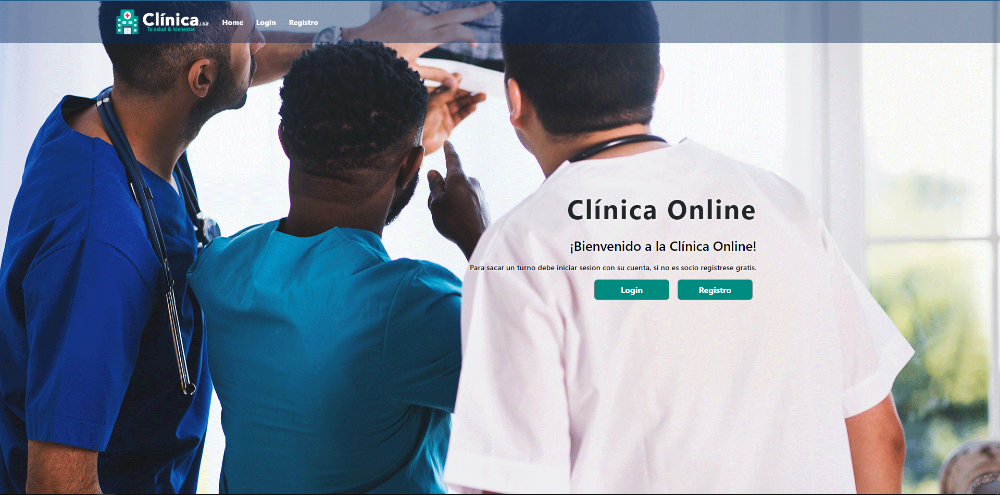
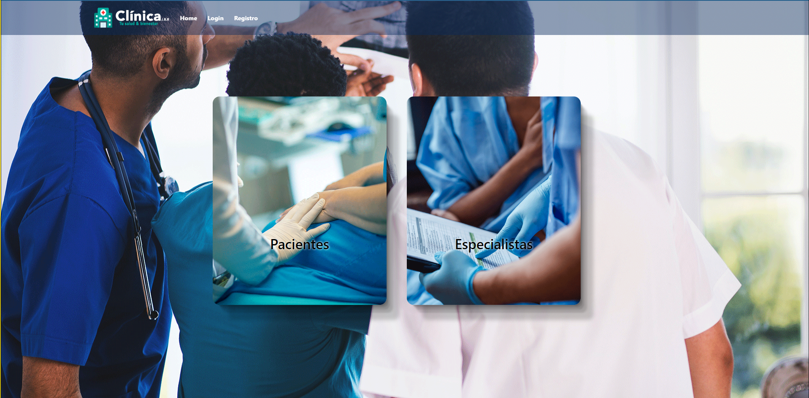

#  🖥️ TP Final Clinica Online 

>  ©️ Desarrollado por Balderrama Rocha Jhossymar 🚀

Clinica Online es una pagina web de turnos para una clinica. El sistema de turnos es flexible y facil y rapido ya sea para el paciente que va sacar un turno o el especialista.

## 📌Pantalla Principal 🏡

🟢- La siguiente imagen es nuestra pantalla principal de la pagina web, donde podemos encontrar un menu en la parte superior de la pantalla con las opciones de login y registrarse.

 

## 📌Login
🟢 - 🎥 Los siguientes pasos son para poder logearse en el sistema de la pagina web. En esta seccion tambien podemos encontrar accesos rapidos para lograr una mayor rapidez en el logueo.

 

## 📌Registro de Usuarios
🟢 - La siguiente imagen nos muestra la pantalla de registro. En esta encontraremos dos opciones de registro ya sea como `paciente` o como un `especialista`.

 

🟢 - 🎥 El siguiente video es el paso a paso de como registrarse en la web:

 

## 📌 👤 Administrador 💻

## 📌Especialista

## 📌Paciente

