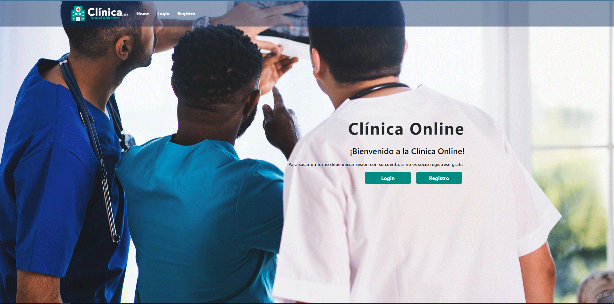
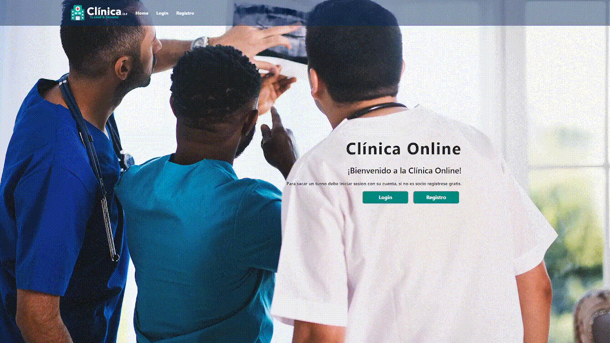
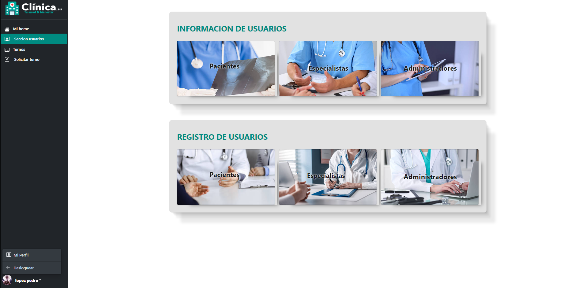
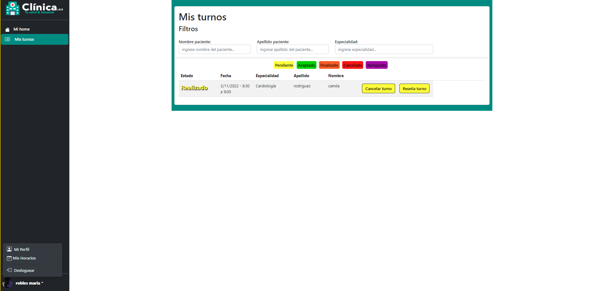
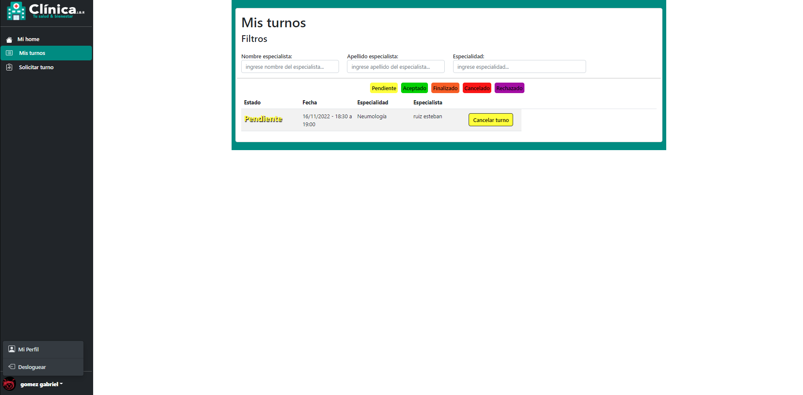

#  🖥️ TP Final Clinica Online 

>  ©️ Desarrollado por Balderrama Rocha Jhossymar 🚀

Clinica Online es una pagina web de turnos para una clinica. El sistema de turnos es flexible y facil y rapido ya sea para el paciente que va sacar un turno o el especialista.

## 📦 Datos 

### 👤 contactos ✉️

| Nombre | Description |
| --- | --- |
| [`GitHub`](https://github.com/Jhossymarbalderrama) | https://github.com/Jhossymarbalderrama |
| [`Linkedin`](https://www.linkedin.com/in/jhossymar-balderrama-rocha-9740aa21b/) | https://www.linkedin.com/in/jhossymar-balderrama-rocha-9740aa21b/ |
| `Gmail` | jhossymarbalderrama@gmail.com |

## 📌Pantalla Principal 🏡

🟢- La siguiente imagen es nuestra pantalla principal de la pagina web, donde podemos encontrar un menu en la parte superior de la pantalla con las opciones de login y registrarse.

 

## 📌Login
🟢 - 🎥 Los siguientes pasos son para poder logearse en el sistema de la pagina web. En esta seccion tambien podemos encontrar accesos rapidos para lograr una mayor rapidez en el logueo.

 

## 📌Registro de Usuarios
🟢 - La siguiente imagen nos muestra la pantalla de registro. En esta encontraremos dos opciones de registro ya sea como `paciente` o como un `especialista`.

 

🟢 - 🎥 El siguiente video es el paso a paso de como registrarse en la web:

 

## 📌 👤 Administrador 💻
🟢 - Pantalla principal de un `Administrador` al loguearse en nuestro sistema.

### 🔷 Opciones Administrador

Los siguientes datos son las funciones posibles y habilitadas que puede hacer un usuario del tipo Administrador

| Opciones | Description |
| --- | --- |
| `Mi Home` | Pantalla de inicio que se encuentra en desarrollo |
| `Seccion Usuarios` | Ver listados de usuarios o registro de usuarios |
| `Turnos` | Listado de todos los turnos de la clinica |
| `Solicitar Turnos` | Formulario o solicitud de un `turno`  |
| `Mi Perfil` | Perfil de Administrador Logueado |

### 🔹 Seccion Usuarios:
 - [ Ver un listado de pacientes, especialistas o administradores ]
 - [ Registros de pacientes, especialistas y administradores]

### 🔹 Turnos:
 - [ Ver el listado general de todos los turnos que tiene la Clinica Online ]

### 🔹 Solicitar Turno:
 - [ Podremos solicitar un turno para un paciente en especifico ]

### 🔹 Mi Perfil:
 - [ Pantalla donde encontraremos todos nuestros datos personales ]

## 📌Especialista
🟢 - Pantalla principal de un `Especialista` al loguearse en nuestro sistema.

### 🔶 Opciones Especialista

Los siguientes datos son las funciones posibles y habilitadas que puede hacer un usuario del tipo Especialista

| Opciones | Description |
| --- | --- |
| `Mi Home` | Pantalla de inicio que se encuentra en desarrollo |
| `Mis Turnos` | Listado de todos los turnos que tiene ese especialista |
| `Mis Horarios` | Pantalla para definir el horario laboral del especialista  |
| `Mi Perfil` | Perfil de especialista Logueado |

### 🔸 Mis Turnos:
 - [ Vemos un listado de todos los turnos que tiene el `Especialista` logueado ]
 
### 🔸 Turnos:
 - [ Ver el listado general de todos los turnos que tiene la Clinica Online ]
 - [ Tambien podresmos hacer las siguientes `Acciones sobre un turno`: `Aceptarlo`, `Finalizarlo` ,`Cancelarlo` o `Rechazarlo`]
 
### 🔸 Mis Horarios:
 - [ En esta pantalla el especialista logueado podra definir su horario laboral de Lunes a Viernes y Sabados ]

### 🔸 Mi Perfil:
 - [ Pantalla donde encontraremos todos nuestros datos personales ]
 
## 📌Paciente
🟢 - Pantalla principal de un `Paciente` al loguearse en nuestro sistema.

### 🔳 Opciones Paciente

Los siguientes datos son las funciones posibles y habilitadas que puede hacer un usuario del tipo Paciente

| Opciones | Description |
| --- | --- |
| `Mi Home` | Pantalla de inicio que se encuentra en desarrollo |
| `Mis Turnos` | Listado de todos los turnos que tiene ese paciente |
| `Solicitar Turno` | Formulario o solicitud de un `turno`   |
| `Mi Perfil` | Perfil de especialista Logueado |

### ◻️ Mis Turnos:
 - [ Vemos un listado de todos los turnos que tiene el `Paciente` logueado ]

### ◻️ Solicitar Turno:
 - [ Podremos solicitar un turno ]

### ◻️ Mi Perfil:
 - [ Pantalla donde encontraremos todos nuestros datos personales ]
 
